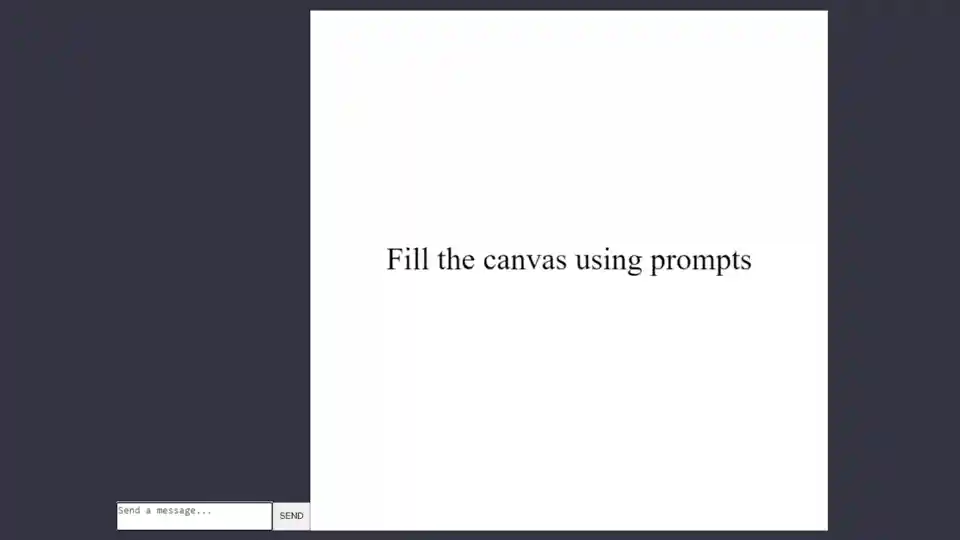
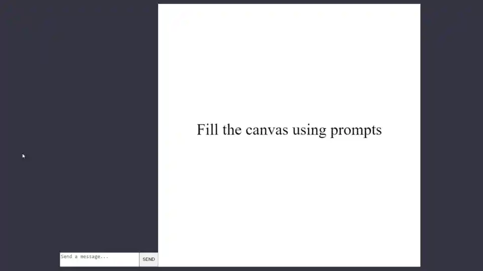

# Canvas AI
This repository contains code for a simple web application that lets you draw and animate a web canvas element using ChatGPT or other openai models.

Quick demo:



You can even use it to create a game:



## Setup
You need node.js and npm: https://nodejs.org/

You need to set your openai API key as an environmental variable:
https://help.openai.com/en/articles/5112595-best-practices-for-api-key-safety

### Linux / MacOS
```
export OPENAI_API_KEY='your-api-key...'
```

### Windows
```
setx OPENAI_API_KEY "your-api-key..."
```
Close the command prompt process completely and start a new one before starting the server.

### Install dependencies and run the server
```
npm install
node server.js
```
View http://localhost:3000/ in a browser and enter your prompts.